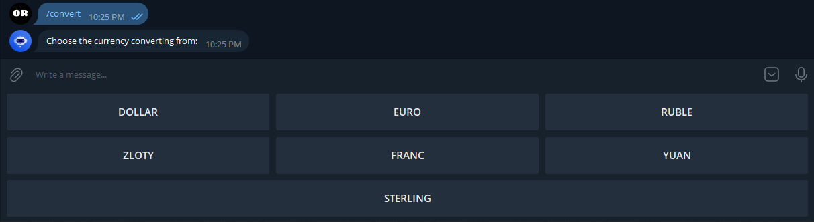
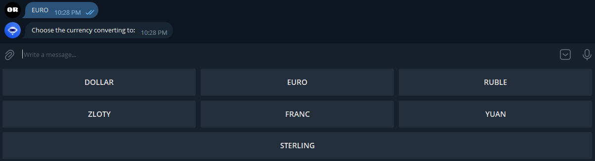

# TelegramBotCurrencyConverter
This is a Telegram Bot to convert currencies using Currency Data API on https://exchangeratesapi.io/

## How to get started?

Run [@BotFather](@BotFather) on Telegram to create your own bot and receive its authentication token. For more information, refer to this official documentation [bots](https://core.telegram.org/bots).

When [@BotFather](@BotFather) appeared in your Telegram, run `/newbot` command and follow a quick instruction until you get a token.

## List of bot commands to interract with it

### Create Bots

* `/newbot` - create a new bot
* `/mybots` - edit your bots [beta]

### Edit Bots

* `/setname` - change a bot's name
* `/setdescription` - change bot description
* `/setabouttext` - change bot about info
* `/setuserpic` - change bot profile photo
* `/setcommands` - change the list of commands
* `/deletebot` - delete a bot

### Bot Settings

* `/token` - generate authorization token
* `/revoke` - revoke bot access token
* `/setinline` - toggle inline mode (https://core.telegram.org/bots/inline)
* `/setinlinegeo` - toggle inline location requests (https://core.telegram.org/bots/inline#location-based-results)
* `/setinlinefeedback` - change inline feedback (https://core.telegram.org/bots/inline#collecting-feedback) settings
* `/setjoingroups` - can your bot be added to groups?
* `/setprivacy` - toggle privacy mode (https://core.telegram.org/bots#privacy-mode) in groups

### Games

* `/mygames` - edit your games (https://core.telegram.org/bots/games) [beta]
* `/newgame` - create a new game (https://core.telegram.org/bots/games)
* `/listgames` - get a list of your games
* `/editgame` - edit a game
* `/deletegame` - delete an existing game
  
## What does **TelegramBotCurrencyConverter** can do?

Currently, it supports 4 commands as below:

* `/start` - Greets a user
* `/help` - Prints all available information with supported commands with a short description
* `/currencies` - Prints a list of supported currencies
* `/convert` - Starts converting currencies based on chosen currency

## Examples

`/start`

`/help`

`/currencies`

`/convert`

That's it! Give it a _Star_ if it was helpful! :)